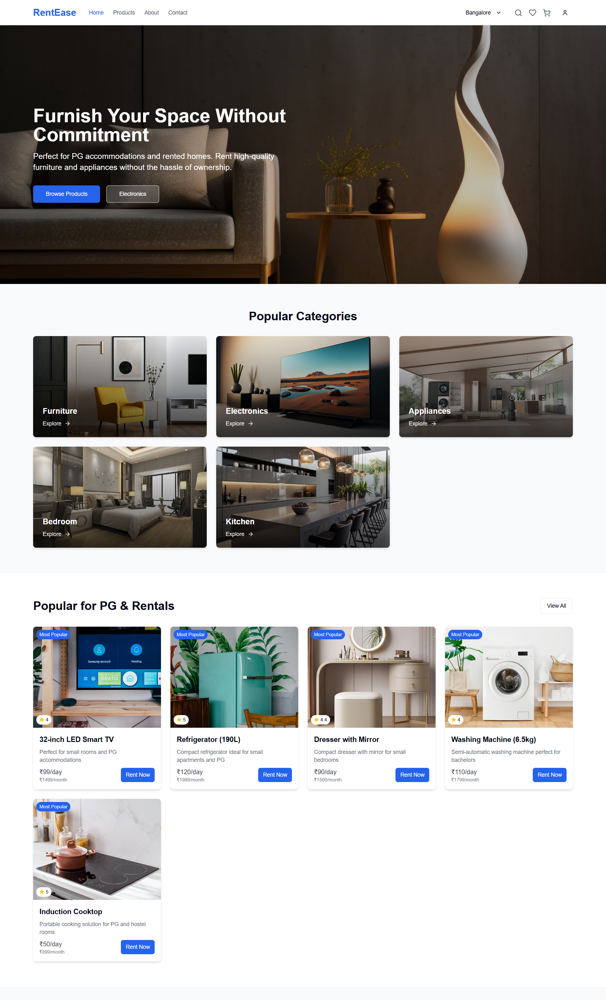
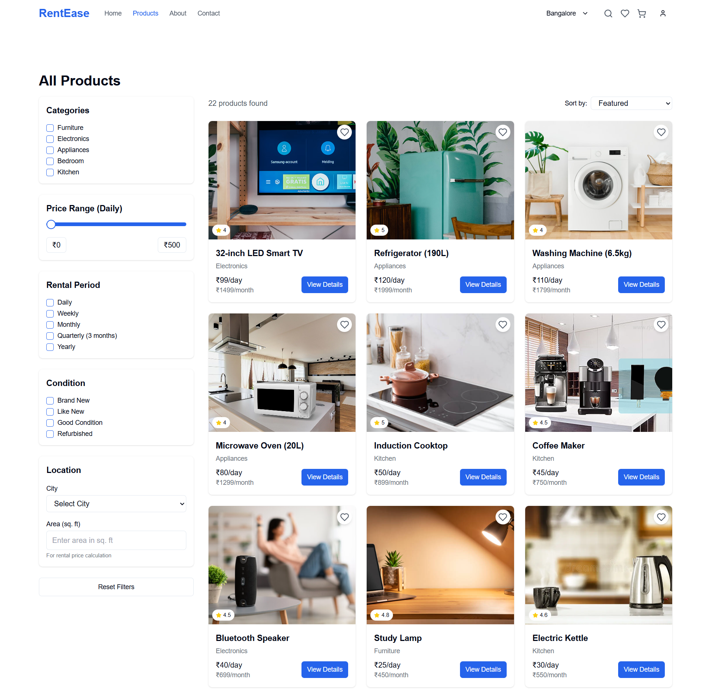
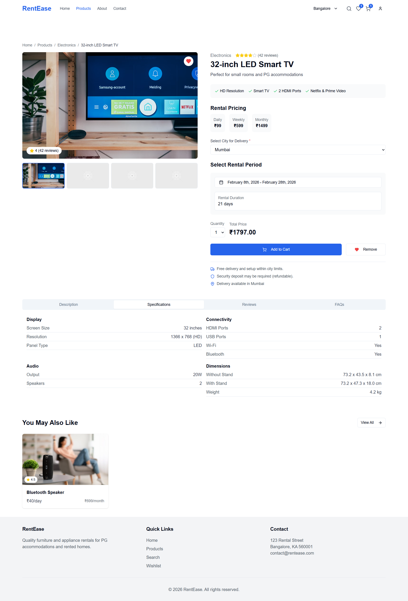

# RentEase — Location-Based Furniture Renting Platform

RentEase is a full-stack web platform that enables users to rent furniture based on geographic location and availability dates. The system supports advanced filtering, cart-based booking workflows, and administrative inventory management.

This project was designed to simulate a real-world rental commerce platform with scalable backend architecture and modular API design.

---

## Overview

Modern rental platforms require accurate availability tracking, location-aware discovery, and structured booking workflows. RentEase implements these core system components using a modular MERN-based architecture.

The application separates frontend presentation, backend business logic, and database layers to ensure scalability, maintainability, and clean system design.

---

## Problem Statement

Short-term renters, students, and urban residents often need furniture temporarily but face high purchase costs and poor resale options.  
RentEase is a location-based rental platform designed to connect renters with available furniture listings, enabling flexible, cost-effective, and short-term furniture usage.

---

## Key Features

### User-Facing Features
- Location-based product discovery  
- Date-range availability booking (start–end date validation)  
- Multi-parameter filtering (category, price, condition)  
- Cart and booking workflow  
- Secure authentication and user account management  
- Order history and booking tracking  

### Admin & System Features
- Product inventory management (CRUD)  
- Availability and booking state management  
- Order and user management dashboard  
- Role-based access control architecture  

---

## System Architecture

Client (React SPA) → REST API Server (Node.js/Express) → MongoDB Database  

The architecture follows a layered separation-of-concerns design to improve scalability, maintainability, and system modularity.

- Frontend handles UI rendering and client-side state management  
- Backend exposes RESTful APIs and implements business logic  
- Database stores structured product, user, and booking data  
- Authentication is implemented using JWT-based middleware  
- Backend follows a modular MVC-style architecture (controllers, routes, models)  

---

## Technology Stack

| Layer | Technologies |
|--------|-------------|
| Frontend | React, Vite, TailwindCSS |
| Backend | Node.js, Express.js |
| Database | MongoDB, Mongoose |
| Authentication | JWT |
| Tooling | Git, GitHub, Postman |
| Deployment (Optional) | Vercel / Render |

---

RentEase/
│
├── frontend/
├── backend/
├── .gitignore
├── package.json
└── README.md


---

## Setup Instructions

```bash
git clone https://github.com/diya-trambadiya/RentEase.git
cd RentEase

cd backend
npm install
npm run dev

cd frontend
npm install
npm run dev

```
---
## Engineering Highlights

- Location-aware filtering and geo-based query logic  
- Date-range availability validation for rental booking windows  
- Modular REST API architecture with separation of concerns  
- JWT-based authentication and protected routes  
- Scalable MongoDB schema design for products and bookings  
- Clean MVC-based backend code organization  

---

## Future Enhancements

- Payment gateway integration  
- Real-time inventory synchronization  
- AI-based furniture recommendation engine  
- Admin analytics dashboard for rental insights  
- Cloud deployment with CI/CD pipelines  

---

## Screenshots

### Home Page


### Product Listing & Filters


### Product Details & Pricing


### Cart & Checkout


---

## Author

**Diya Trambadiya**  
Software Engineer | Full-Stack & AI-Oriented Systems Developer  


